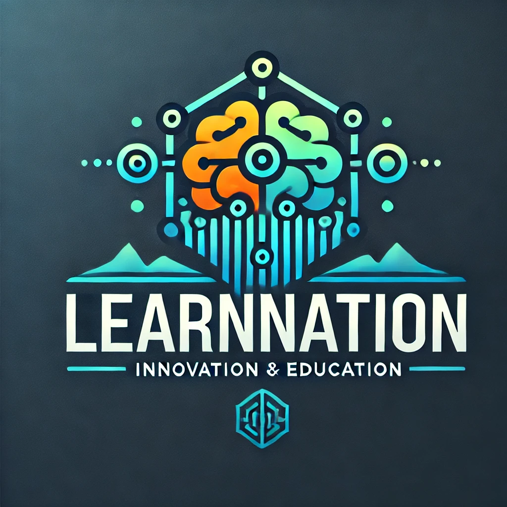

# LearnNation AI Assistant Development Assignment

## Task Overview

LearnNation is assembling a specialized AI development team to lead our next generation of educational technology. This project will serve as an assessment of your potential to join this team. As part of our strategic initiative to explore new frontiers in personalized learning, you will develop an AI-powered terminal assistant using Python and the Gemini API. Your performance on this project will be a key factor in determining your role in LearnNation's AI future.

#### This project serves these key purposes:

1. **Skill Assessment & Growth**: This task evaluates your ability to work with emerging AI technologies and complex software systems. Strong performance could lead to opportunities in our new AI Integration Department, where you'll help shape LearnNation's next generation of educational tools.

1. **Critical Thinking**: This task tests your ability to think critically about project requirements and to plan and execute your work in a way that is both efficient and effective both in code and in NLP strategies.

1. **Organization**: This task tests your ability to organize your work and manage your time effectively.

1. **Product Prototyping**: Your assistant will serve as a prototype for LearnNation's expansion into AI-enhanced learning experiences. The most successful implementations may be selected for further development and integration into our core product offerings, with the original developers taking lead roles in those initiatives.

## What is an AI Assistant?

An AI assistant is a software application that uses artificial intelligence to engage in natural language conversations with users. Your assistant will:
- Process and understand natural language inputs
- Generate contextually relevant responses
- Maintain conversation context
- Provide specialized knowledge in a specific domain
- Adapt responses based on user interactions

## Scope

You will build a terminal-based AI assistant that specializes in a specific knowledge domain. The task is structured in tiers, allowing us to evaluate both core competencies and advanced capabilities. You may choose to build your AI assistant in _Python_ or in _JavaScript_ using _Node.js_ for a terminal application or _React_ for a web application.

 Remember to use your knowledge of Prompt Engineering to build your assistant. ([Prompt Engineering Session](https://github.com/jdrichards-pursuit/week-6.1-6.2-prompt-engineering-theory/blob/main/lesson.ipynb)). Refer to the [Gemini API documentation](https://ai.google.dev/gemini-api/docs/quickstart?lang=node) for Node.jsif you plan to use Node.js or React since we have not reviewed this in our sessions. 
 
 [Gemini API Documentation - Node.js](https://ai.google.dev/gemini-api/docs/quickstart?lang=node) 

**Note:** If you choose to build your assistant in React, you will need to create a visual interface for your assistant instead of using the terminal.

## Choose Your Assistant's Specialty

Select one of the following specialties or propose your own (subject to approval):

1. Fitness Coach
1. Creative Writing Mentor
1. Personal Finance Advisor
1. Cooking Companion
1. Travel Planner
1. Language Learning Partner
1. Mindfulness Guide
1. DIY Project Helper
1. Career Development Coach
1. Environmental Advisor
1. Tech Support Assistant
1. Gardening Guide
1. Productivity Coach
1. Wine Suggester

### Example Assistant

Here is an example of a basic assistant that can be built with the current instructions. [Example Assistant](https://drive.google.com/file/d/17Z3HL_siiINTLJ_wU-FbWunN_UkU2K1O/view?usp=sharing)

## Planning & Development

- Plan, Plan, Plan! Before you start coding, you should plan your assistant. Refer to the [Planning Your AI Assistant](./planning.md) file for more information.
- Use the `index.py` file to create all of your code.
- Use a `.env` file to store your API keys.
- Read the suggestions in the `index.py` file to help you get started.

## Development Tiers

### Tier 1: Core Assistant Implementation
**Required - This is the foundation of your assistant**

Focus: Build a functional AI assistant that can engage in specialty-specific conversations.

**Requirements:**
- Configure Gemini API integration
- Implement specialized system instructions
- Create basic conversation handling
- Add error handling for API interactions
- Ensure responses align with the chosen specialty

### Tier 2: Enhanced Context Management _(optional - Adds intelligence to your assistant)_

- Focus: Improve response relevance through topic classification using keywords.
- Relevance: Improve specificity of responses using system instructions.
- Control Output: Improve the quality of responses using output formatting and few shot prompting.

**Tasks:**
- Define specialty-specific topics and subtopics
- Implement topic classification for user inputs
- Enhance prompts with topic context

### Tier 3: Advanced Features _(optional - For additional functionality)_

Focus: Add conversation storage and analysis capabilities.

**Tasks:**
- Add basic memory of current conversation
- Implement conversation history storage
- Add conversation summarization
- Create conversation search functionality
- Enable data persistence between sessions

## Testing Requirements

1. Core Functionality (Required):
   - API integration works correctly
   - Assistant stays in character
   - Responses are relevant and helpful
   - Error handling works effectively

2. Enhanced Features (If implemented):
   - Topic classification is accurate
   - Context management improves responses
   - Storage and retrieval work correctly

## Strategic Impact

Your work on this assignment has the potential to:
1. Shape _LearnNation's_ approach to AI-enhanced learning
2. Establish best practices for future AI integrations
3. Create new opportunities for personalized education
4. Define the foundation for our next generation of products

## Career Development Opportunities

Based on performance, developers may be:
1. Selected to join the AI Integration Department
2. Lead the development of their assistant into a full product
3. Contribute to LearnNation's AI strategy and architecture
4. Mentor future teams in AI development

## Resources

- [Planning Your AI Assistant](./planning.md)
- [Python Virtual Environment Setup](https://github.com/jdrichards-pursuit/python-virtual-environment-setup)
- [NLP Prompting Lesson](https://github.com/jdrichards-pursuit/week-6.1-6.2-prompt-engineering-theory/blob/main/lesson.ipynb)
- [Gemini API Documentation](https://ai.google.dev/gemini-api/docs)
- [Python Documentation](https://docs.python.org/3/)

Remember: Your work will help shape the future of personalized learning at LearnNation. Focus on building a robust core assistant first, then enhance it with additional features as time allows.

